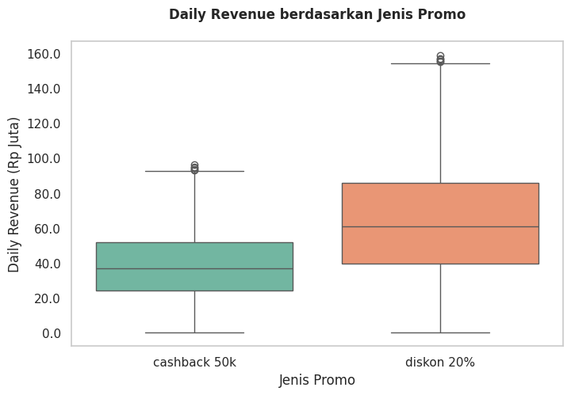
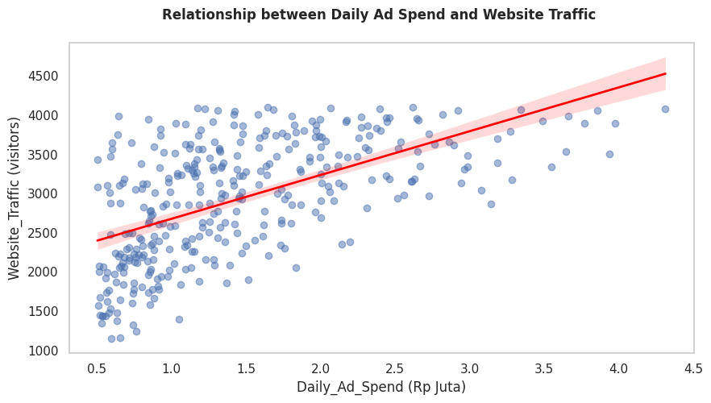

# Marketing Statistical Audit: Evaluasi Efektivitas Promo dan Dampak Biaya Iklan

## Deskripsi Proyek

Proyek ini merupakan audit statistik terhadap kampanye pemasaran akhir tahun PT Vinix Seven Aurum. Analisis dilakukan untuk membantu tim Finance dan Marketing dalam mengevaluasi efektivitas strategi promosi serta memahami pengaruh biaya iklan terhadap jumlah pengunjung website.

Melalui pendekatan statistik, proyek ini berfokus pada dua pertanyaan bisnis utama:

1. Apakah terdapat perbedaan performa yang signifikan antara promo Diskon 20% dan Cashback Rp50.000?
2. Seberapa besar pengaruh biaya iklan terhadap jumlah pengunjung website?

---

## Latar Belakang

Dalam kegiatan pemasaran, perusahaan sering menjalankan berbagai strategi promosi dan mengalokasikan anggaran iklan dalam jumlah besar. Namun, tanpa analisis berbasis data, sulit untuk mengetahui strategi mana yang benar-benar memberikan dampak terbaik terhadap performa bisnis.

Oleh karena itu, dilakukan audit statistik untuk memberikan dasar pengambilan keputusan yang lebih objektif dan terukur.

---

## Dataset

Dataset terdiri dari 1.060 data dengan variabel sebagai berikut:

| Variabel        | Deskripsi                          |
| --------------- | ---------------------------------- |
| Daily Ad Spend  | Total biaya iklan harian (Rp)      |
| Website Traffic | Jumlah pengunjung website per hari |
| Daily Revenue   | Total pendapatan harian (Rp)       |
| Promo Active    | Jenis promo yang sedang berjalan   |

Kategori promo yang digunakan:

* Diskon 20%
* Cashback Rp50.000

---

## Tools yang Digunakan

* Python
* Pandas
* Seaborn
* Matplotlib
* SciPy
* Statsmodels
* Google Colab

---

## Tahapan Analisis

### 1. Data Inspection

Pemeriksaan awal dilakukan untuk memahami struktur data dan mengidentifikasi inkonsistensi.

Ditemukan beberapa variasi penulisan pada kolom Promo Active, seperti:

* cashback 50k
* Cashback 50K
* CB 50K
* Diskon 20 %
* Diskon-20%

Seluruh kategori kemudian distandarisasi agar konsisten.

---

### 2. Data Cleaning

#### Penanganan Missing Value

Sebanyak 44 data dengan nilai kosong pada kolom Daily Ad Spend dihapus agar tidak mempengaruhi hasil analisis.

#### Penanganan Outlier

Outlier diidentifikasi menggunakan metode Interquartile Range (IQR).

Visualisasi scatter plot digunakan untuk memverifikasi keberadaan data ekstrem pada variabel:

* Daily Ad Spend
* Website Traffic

Outlier kemudian ditangani agar hubungan antar variabel tidak terdistorsi.

---

### 3. Uji Hipotesis (Independent T-Test)

**Tujuan:** Membandingkan rata-rata pendapatan antara promo Diskon 20% dan Cashback Rp50.000.

**Hipotesis:**

H0 : Tidak terdapat perbedaan rata-rata revenue antara kedua promo.

H1 : Terdapat perbedaan rata-rata revenue antara kedua promo.

**Tingkat signifikansi:** α = 0,05

#### Hasil

* T-Statistic = 14,3229
* P-Value < 0,001

#### Insight

Hasil menunjukkan bahwa terdapat perbedaan yang signifikan antara kedua strategi promosi.

Promo Diskon 20% terbukti menghasilkan revenue yang lebih tinggi dibandingkan promo Cashback Rp50.000.

---

### 4. Analisis Regresi Linear

**Tujuan:** Menganalisis hubungan antara biaya iklan dan jumlah pengunjung website.

**Model:** Website Traffic ~ Daily Ad Spend

#### Hasil

* Koefisien Regresi = 0,0006
* R-Squared = 0,3314
* P-Value < 0,001

#### Insight

Terdapat hubungan positif antara biaya iklan dan jumlah pengunjung website.

Setiap tambahan biaya iklan sebesar Rp1.000.000 berpotensi meningkatkan jumlah pengunjung sekitar 600 orang.

Namun, biaya iklan hanya menjelaskan sekitar 33% variasi jumlah pengunjung sehingga masih terdapat faktor lain yang mempengaruhi performa website.

---

## Temuan Utama

* Promo Diskon 20% lebih efektif dibandingkan Cashback Rp50.000 dalam meningkatkan revenue.

* Peningkatan biaya iklan berkontribusi terhadap peningkatan jumlah pengunjung website.

* Keputusan pemasaran dapat didukung menggunakan pendekatan statistik untuk meminimalkan pengambilan keputusan berdasarkan asumsi.

---

## Rekomendasi

1. Memprioritaskan promo Diskon 20% pada kampanye berikutnya.
2. Mengoptimalkan alokasi anggaran iklan untuk meningkatkan traffic website.
3. Menambahkan variabel lain seperti:

   * Conversion Rate
   * Customer Retention
   * Customer Acquisition
   * Channel Marketing
4. Melakukan evaluasi kampanye secara berkala menggunakan pendekatan statistik.

---

## Visualisasi

### Perbandingan Revenue Berdasarkan Jenis Promo

### Hubungan Daily Ad Spend dan Website Traffic

---

## Skill yang Ditunjukkan

* Data Cleaning
* Data Profiling
* Exploratory Data Analysis (EDA)
* Statistical Testing
* Independent T-Test
* Linear Regression
* Data Visualization
* Marketing Analytics
* Business Insight Generation

---

## Author

Shofia Nabila

Studi Independen Data Analyst | Vinix7

Sistem Informasi Kelautan | Universitas Pendidikan Indonesia

